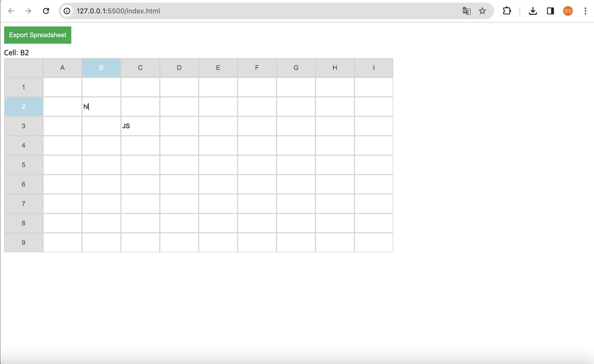

## 자바스크립트를 이용해서 Spread Sheet 앱 만들기
- 위와 같이 현재 focus 된 셀의 위쪽 헤더 왼쪽 헤더가 함께 하늘색으로 하이라이트 되게 해 줍니다.
- 작성된 모든 데이터들을 Export SpreadSheet 버튼을 눌러서 Excel 파일로 생성합니다.
- 생성된 Excel 파일을 구글 Spreadsheet 에서 Import 하면 같은 데이터가 나오게 합니다.
